# Ecommerce React Application

## Overview

A ReactJS ecommerce application built with a **React frontend** and a **Node.js backend**.

The frontend implementation — including UI integration, routing, and client-side logic — was developed manually. The backend layer is primarily AI-generated; more than 95% of the backend codebase was produced using AI-assisted workflows by [SuperSimpleDev](https://github.com/SuperSimpleDev).

The application provides product browsing, cart management, checkout, order handling, and order tracking through a REST-based client–server architecture.

---

## Technologies

### Frontend


### Backend


### Database


---

## Architecture

```mermaid
%%{init: {
  "theme": "base",
  "themeVariables": {
    "background": "#0b0f19",
    "primaryColor": "#111827",
    "primaryTextColor": "#ffffff",
    "primaryBorderColor": "#ffffff",
    "lineColor": "#ffffff",
    "secondaryColor": "#111827",
    "tertiaryColor": "#111827",
    "clusterBkg": "#0f172a",
    "clusterBorder": "#ffffff",
    "fontFamily": "Inter, sans-serif",
    "edgeLabelBackground": "#0b0f19"
  }
}}%%

flowchart TD

subgraph group_backend["Backend API"]
  node_backend_server["Server<br/>HTTP entry<br/>[server.js]"]
  node_backend_routes_products["Products API<br/>route<br/>[products.js]"]
  node_backend_routes_cart["Cart API<br/>route<br/>[cartItems.js]"]
  node_backend_routes_delivery["Delivery API<br/>route<br/>[deliveryOptions.js]"]
  node_backend_routes_orders["Orders API<br/>route<br/>[orders.js]"]
  node_backend_routes_summary["Pricing API<br/>route<br/>[paymentSummary.js]"]
  node_backend_routes_reset["Reset API<br/>route<br/>[reset.js]"]
  node_backend_models["Domain Models<br/>schema layer<br/>[index.js]"]
  node_backend_defaults["Default Data<br/>fixtures"]
  node_backend_state[("JSON Store<br/>file state")]
  node_backend_images["Media Assets<br/>static assets"]
end

subgraph group_frontend["React Frontend"]
  node_frontend_app["App Shell<br/>React shell<br/>[App.tsx]"]
  node_frontend_header["Header<br/>shared UI<br/>[Header.tsx]"]
  node_frontend_home["Home Page<br/>[HomePage.jsx]"]
  node_frontend_checkout["Checkout Page<br/>[CheckoutPage.jsx]"]
  node_frontend_orders["Orders Page<br/>[OrdersPage.jsx]"]
  node_frontend_tracking["Aux Pages<br/>page set<br/>[TrackingPage.jsx]"]
  node_frontend_money["Money Utils<br/>client util<br/>[money.ts]"]
  node_frontend_public_images["Public Images<br/>static assets"]
end

subgraph group_legacy["Legacy Frontend"]
  node_legacy_app["Legacy App<br/>React shell<br/>[App.jsx]"]
  node_legacy_pages["Legacy Pages<br/>page set"]
  node_legacy_money["Legacy Money<br/>client util<br/>[money.js]"]
end

node_backend_server -->|"mounts"| node_backend_routes_products
node_backend_server -->|"mounts"| node_backend_routes_cart
node_backend_server -->|"mounts"| node_backend_routes_delivery
node_backend_server -->|"mounts"| node_backend_routes_orders
node_backend_server -->|"mounts"| node_backend_routes_summary
node_backend_server -->|"mounts"| node_backend_routes_reset
node_backend_server -->|"uses"| node_backend_models
node_backend_server -->|"persists"| node_backend_state
node_backend_server -.->|"seeds from"| node_backend_defaults
node_backend_routes_products -->|"reads"| node_backend_models
node_backend_routes_cart -->|"reads/writes"| node_backend_models
node_backend_routes_cart -->|"stores"| node_backend_state
node_backend_routes_delivery -->|"reads"| node_backend_models
node_backend_routes_delivery -->|"stores"| node_backend_state
node_backend_routes_orders -->|"reads/writes"| node_backend_models
node_backend_routes_orders -->|"stores"| node_backend_state
node_backend_routes_summary -->|"reads"| node_backend_state
node_backend_routes_summary -->|"uses"| node_backend_models
node_backend_routes_reset -->|"loads"| node_backend_defaults
node_backend_routes_reset -->|"overwrites"| node_backend_state

node_frontend_app -->|"composes"| node_frontend_header
node_frontend_app -->|"routes to"| node_frontend_home
node_frontend_app -->|"routes to"| node_frontend_checkout
node_frontend_app -->|"routes to"| node_frontend_orders
node_frontend_app -->|"routes to"| node_frontend_tracking
node_frontend_app -->|"uses"| node_frontend_money

node_frontend_home -->|"fetches"| node_backend_routes_products
node_frontend_home -->|"renders"| node_frontend_public_images

node_frontend_checkout -->|"fetches"| node_backend_routes_cart
node_frontend_checkout -->|"fetches"| node_backend_routes_delivery
node_frontend_checkout -->|"fetches"| node_backend_routes_summary
node_frontend_checkout -->|"submits"| node_backend_routes_orders

node_frontend_orders -->|"fetches"| node_backend_routes_orders
node_frontend_tracking -->|"fetches"| node_backend_routes_orders

node_legacy_app -->|"composes"| node_legacy_pages
node_legacy_app -->|"uses"| node_legacy_money

classDef backend fill:#111827,stroke:#60a5fa,color:#ffffff,stroke-width:2px;
classDef frontend fill:#111827,stroke:#f59e0b,color:#ffffff,stroke-width:2px;
classDef legacy fill:#111827,stroke:#10b981,color:#ffffff,stroke-width:2px;

class node_backend_server,node_backend_routes_products,node_backend_routes_cart,node_backend_routes_delivery,node_backend_routes_orders,node_backend_routes_summary,node_backend_routes_reset,node_backend_models,node_backend_defaults,node_backend_state,node_backend_images backend;

class node_frontend_app,node_frontend_header,node_frontend_home,node_frontend_checkout,node_frontend_orders,node_frontend_tracking,node_frontend_money,node_frontend_public_images frontend;

class node_legacy_app,node_legacy_pages,node_legacy_money legacy;
```



---

## Project Structure

### Frontend — `ecommerce-project/`

#### App Shell

[`App.tsx`](https://github.com/abidev2003/ecommerce-react-ssd/blob/main/ecommerce-project/src/App.tsx) — Application entry point. Manages routing via React Router and composes the top-level layout.

#### Shared Components

| File                                                                                                                    | Responsibilities                                      |
| ----------------------------------------------------------------------------------------------------------------------- | ----------------------------------------------------- |
| [`Header.tsx`](https://github.com/abidev2003/ecommerce-react-ssd/blob/main/ecommerce-project/src/components/Header.tsx) | Navigation bar, cart indicator, shared layout wrapper |

#### Pages

| File                                                                                                                                    | Responsibilities                                             |
| --------------------------------------------------------------------------------------------------------------------------------------- | ------------------------------------------------------------ |
| [`HomePage.jsx`](https://github.com/abidev2003/ecommerce-react-ssd/blob/main/ecommerce-project/src/pages/home/HomePage.jsx)             | Product listing, product data fetching, search integration   |
| [`CheckoutPage.jsx`](https://github.com/abidev2003/ecommerce-react-ssd/blob/main/ecommerce-project/src/pages/checkout/CheckoutPage.jsx) | Cart management, delivery option selection, order submission |
| [`OrdersPage.jsx`](https://github.com/abidev2003/ecommerce-react-ssd/blob/main/ecommerce-project/src/pages/orders/OrdersPage.jsx)       | Order history display                                        |
| [`TrackingPage.jsx`](https://github.com/abidev2003/ecommerce-react-ssd/blob/main/ecommerce-project/src/pages/TrackingPage.jsx)          | Order tracking interface                                     |

#### Utilities

| File                                                                                                           | Responsibilities                     |
| -------------------------------------------------------------------------------------------------------------- | ------------------------------------ |
| [`money.ts`](https://github.com/abidev2003/ecommerce-react-ssd/blob/main/ecommerce-project/src/utils/money.ts) | Currency formatting, pricing helpers |

---

### Backend — `ecommerce-backend-ai-main/`

#### Server Layer

[`server.js`](https://github.com/abidev2003/ecommerce-react-ssd/blob/main/ecommerce-backend-ai-main/server.js) — Registers all API routes, configures middleware, and handles application bootstrap.

#### Route Modules

| File                                                                                                                                    | Endpoint               | Responsibilities                         |
| --------------------------------------------------------------------------------------------------------------------------------------- | ---------------------- | ---------------------------------------- |
| [`products.js`](https://github.com/abidev2003/ecommerce-react-ssd/blob/main/ecommerce-backend-ai-main/routes/products.js)               | `/api/products`        | Product retrieval and search             |
| [`cartItems.js`](https://github.com/abidev2003/ecommerce-react-ssd/blob/main/ecommerce-backend-ai-main/routes/cartItems.js)             | `/api/cartItems`       | Cart item CRUD operations                |
| [`deliveryOptions.js`](https://github.com/abidev2003/ecommerce-react-ssd/blob/main/ecommerce-backend-ai-main/routes/deliveryOptions.js) | `/api/deliveryOptions` | Delivery option retrieval                |
| [`orders.js`](https://github.com/abidev2003/ecommerce-react-ssd/blob/main/ecommerce-backend-ai-main/routes/orders.js)                   | `/api/orders`          | Order creation and retrieval             |
| [`paymentSummary.js`](https://github.com/abidev2003/ecommerce-react-ssd/blob/main/ecommerce-backend-ai-main/routes/paymentSummary.js)   | `/api/paymentSummary`  | Checkout totals and pricing calculations |
| [`reset.js`](https://github.com/abidev2003/ecommerce-react-ssd/blob/main/ecommerce-backend-ai-main/routes/reset.js)                     | `/api/reset`           | Restores default application state       |

#### Data Layer

| Resource      | Location                                                                                                                   | Description                                     |
| ------------- | -------------------------------------------------------------------------------------------------------------------------- | ----------------------------------------------- |
| Domain Models | [`models/index.js`](https://github.com/abidev2003/ecommerce-react-ssd/blob/main/ecommerce-backend-ai-main/models/index.js) | Schema definitions and shared data access layer |
| JSON Store    | [`backend/`](https://github.com/abidev2003/ecommerce-react-ssd/tree/main/ecommerce-backend-ai-main/backend)                | File-based persistent application state         |
| Default Data  | [`defaultData/`](https://github.com/abidev2003/ecommerce-react-ssd/tree/main/ecommerce-backend-ai-main/defaultData)        | Seed fixtures loaded on reset                   |
| Media Assets  | [`images/`](https://github.com/abidev2003/ecommerce-react-ssd/tree/main/ecommerce-backend-ai-main/images)                  | Statically served product images                |

---

### Legacy Application — `old-projects/ecommerce-project-js/`

An older JavaScript implementation of the frontend. Kept for reference.

| File                                                                                                                           | Description                    |
| ------------------------------------------------------------------------------------------------------------------------------ | ------------------------------ |
| [`App.jsx`](https://github.com/abidev2003/ecommerce-react-ssd/blob/main/old-projects/ecommerce-project-js/src/App.jsx)         | Legacy React app shell         |
| [`pages/`](https://github.com/abidev2003/ecommerce-react-ssd/tree/main/old-projects/ecommerce-project-js/src/pages)            | Previous page implementations  |
| [`money.js`](https://github.com/abidev2003/ecommerce-react-ssd/blob/main/old-projects/ecommerce-project-js/src/utils/money.js) | Legacy currency utility module |

---

## Application Flow

```
1. Frontend fetches product catalogue from the Products API
2. User adds items to the cart (Cart API)
3. Checkout page loads cart contents, delivery options, and pricing summary
4. Payment Summary API calculates order totals
5. User submits order → Orders API persists it
6. Orders and Tracking pages retrieve order data from the Orders API
```

## Notes

- The frontend and backend are **fully decoupled** into independent modules.
- Backend routes are **organized by feature domain**, each owning its own state interactions.
- Static media assets are served independently for both frontend and backend environments.
- The project uses **TypeScript for utility modules, pages and components** and JavaScript for legacy ones.
- The Reset API endpoint can be used during development to restore the application to its default seeded state.
